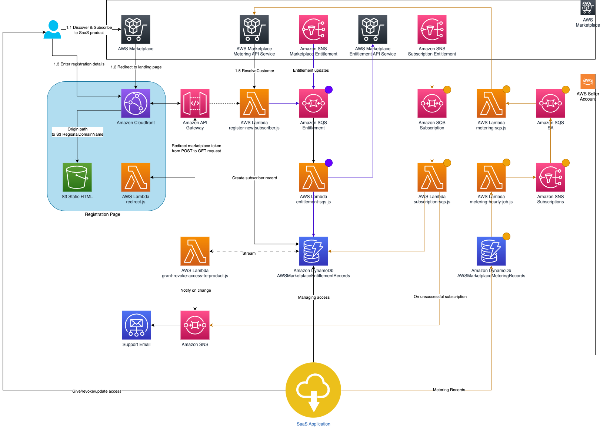

// Add steps as necessary for accessing the software, post-configuration, and testing. Don’t include full usage instructions for your software, but add links to your product documentation for that information.
//Should any sections not be applicable, remove them

== How it works
// If steps are required to test the deployment, add them here. If not, remove the heading

As shown in <<architecture2>>,the {partner-product-short-name} on AWS environment sets up the following workflow of events. 

[#architecture2]
.Workflow of {partner-product-short-name} on AWS environment

=== Register new customers

With SaaS subscriptions and contracts, customers subscribe to your products through AWS Marketplace, but they access the product on an environment that you manage in your AWS account. After subscribing to a product, customers are directed to a product registration page that you create and manage as a part of your SaaS product. 

On your software’s registration page, you can collect whatever information is required to create an account for your customer. AWS Marketplace recommends collecting email addresses if you plan to send customers usage notifications.

The registration page identifies and accepts the *x-amzn-marketplace-token* token from the AWS Marketplace form data. The token includes the customer’s identifier for billing. The page then passes the token value to the AWS Marketplace Metering Service and AWS Marketplace Entitlement Service APIs to resolve for the unique customer identifier and corresponding product code.

<<<<<<< HEAD
The Quick Start creates a static HTML registration page hosted on Amazon S3. The page takes user inputs that are defined in the HTML form and submits them to the customer endpoint on AWS Marketplace. The page is delivered via a CloudFront distribution, which can be configured to use domain/CNAME. The POST request coming from AWS Marketplace is intercepted by the Lambda@Edge *src/lambda-edge/edge-redirect.js* function, which transforms the POST request to a GET request and passes the *x-amzn-marketplace-token* in the query string. The handler for the customer endpoint on AWS Marketplace is defined in the *src/register-new-subscriber.js* function, which calls the *resolveCustomer* endpoint and validates the token. If the token is valid, the customer record is created in the *AWSMarketplaceSubscribers* DynamoDB table, and the new customer data is stored.
=======
The Quick Start creates a static HTML registration page hosted on Amazon S3. The page takes user inputs that are defined in the HTML form and submits them to the customer endpoint on AWS Marketplace. The page is delivered via a CloudFront distribution, which can be configured to use domain/CNAME. The POST request coming from AWS Marketplace is intercepted by the Lambda *src/redirect.js* function, which transforms the POST request to a GET request and passes the *x-amzn-marketplace-token* in the query string. The handler for the customer endpoint on AWS Marketplace is defined in the *src/register-new-subscriber.js* function, which calls the *resolveCustomer* endpoint and validates the token. If the token is valid, the customer record is created in the *AWSMarketplaceSubscribers* DynamoDB table, and the new customer data is stored.
>>>>>>> doc-edits

=== Grant access to new subscribers

After the *resolveCustomer* endpoint returns a successful response, you (the SaaS provider) must provide the new subscriber access to the solution. Based on the type of listing (contract or subscriptions), different conditions are defined in the *grant-revoke-access-to-product.js* stream handler that's initiated when adding new or updating existing rows.

In the Quick Start deployment, the AWS Marketplace Tech Admin email address (which is defined as the *MarketplaceTechAdmin* deployment parameter) receives email notifications when new services must be provisioned or existing services must be updated for a customer. AWS Marketplace strongly recommends automating the access and environment management by modifying the *grant-revoke-access-to-product.js* function. The property *successfully subscribed* is set when a successful response is returned by the Amazon Simple Queue Service (Amazon SQS) entitlement handler for SaaS contract-based listings or for subscriptions-based listings after receiving the *subscribe-success* message from the subscription Amazon Simple Notification Service (Amazon SNS) topic in the *subscription-sqs-handler.js* function.

=== Update entitlement levels to new and existing subscribers (SaaS contracts only)

If a customer’s entitlement changes, a message is received on the Amazon SNS topic for the entitlement. On each new message, the *entitlement-sqs.js* Lambda function calls the AWS Marketplace *EntitlementService* endpoint and stores the response in the *AWSMarketplaceSubscribers* DynamoDB table. When the entitlement is updated, a notification is sent to the AWS Marketplace Tech Admin email address.

=== Revoke access to customers with expired contracts and canceled subscriptions

The revoke-access logic is implemented in a similar way as the grant-access logic. The AWS Marketplace Tech Admin address receives an email when the contract expires or the subscription is canceled. AWS Marketplace strongly recommends automating the access and environment management by modifying the *grant-revoke-access-to-product.js* function.

=== Meter for usage

For SaaS subscriptions listings, the SaaS vendor must meter for all usage and report the metering record to AWS Marketplace, which then bills customers based on the records provided. For SaaS contracts, the vendor only meters for usage beyond a customer’s contract entitlements. The SaaS provider must send AWS a quantity of usage accrued for each customer on the dimensions defined when you created your product, such as gigabytes transferred or hosts scanned in a given hour.

The *MeteringSchedule* CloudWatch event rule is triggered every hour. At that time, the *metering-hourly-job.js* function queries all of the pending and unreported metering records from the *AWSMarketplaceMeteringRecords* table using the *PendingMeteringRecordsIndex* index. All pending records are aggregated based on the *customerIdentifier* property and dimension name and sent to the *SQSMetering* queue. The records in the *AWSMarketplaceMeteringRecords* table should be inserted programmatically by your SaaS application. To allow write access to the *AWSMarketplaceMeteringRecords* table, you must give permissions to the service in charge of collecting usage data in your existing SaaS product.

The *metering-sqs.js* Lambda function sends all queued metering records to the AWS Marketplace Metering Service API. After each call to the *batchMeterUsage* endpoint, the rows in the *AWSMarketplaceMeteringRecords* table are updated with the response returned from the Metering Service. Responses are stored in the *metering_response* field. If the request is unsuccessful, the *metering_failed* value is set to true, and you must investigate the error defined in the *metering_response* field.

New records in the *AWSMarketplaceMeteringRecords* table should be stored in the following format:

....
{
<<<<<<< HEAD
  "create_timestamp": 113123,
  "customerIdentifier": "ifAPi5AcF3",
  "dimension_usage": [
    {
      "dimension": "users",
      "value": 3
    },
     {
      "dimension": "admin_users",
      "value": 1
    }
  ],
  "metering_pending": "true"
=======
  "create_timestamp": {
    "N": "113123"
  },
  "customerIdentifier": {
    "S": "ifAPi5AcF3"
  },
  "dimension_usage": {
    "L": [
      {
        "M": {
          "dimension": {
            "S": "users"
          },
          "value": {
            "N": "3"
          }
        }
      },
      {
        "M": {
          "dimension": {
            "S": "admin_users"
          },
          "value": {
            "N": "1"
          }
        }
      }
    ]
  },
  "metering_pending": {
    "S": "true"
  }
>>>>>>> doc-edits
}
....

The *create_timestamp* attribute is the sort key, and the *customerIdentifier* attribute is the partition key. The sort and partition keys are combined to form the primary key.
 
After the record is submitted to the AWS Marketplace API, the record updates, and the entry looks similar to the following: 

....
{
   "create_timestamp": 113123,
   "customerIdentifier": "ifAPi5AcF3",
   "dimension_usage": [
     {
       "dimension": "admin_users",
       "value": 3
     }
   ],
   "metering_failed": false,
   "metering_response": "{\"Results\":[{\"UsageRecord\":{\"Timestamp\":\"2020-06-24T04:04:53.776Z\",\"CustomerIdentifier\":\"ifAPi5AcF3\",\"Dimension\":\"admin_users\",\"Quantity\":3},\"MeteringRecordId\":\"35155d37-56cb-423f-8554-5c4f3e3ff56d\",\"Status\":\"Success\"}],\"UnprocessedRecords\":[]}"
 }
....

== Post-deployment steps
// If post-deployment steps are required, add them here. If not, remove the heading

<<<<<<< HEAD
=== Set up your registration page

After your stack has launched successfully, set up your registration page and connect it with the API Gateway created by the stack. Your registration page will be hosted in the website S3 bucket that was created by the stack earlier. 

. https://awsmp-usageinstructions.s3.amazonaws.com/SaaSQuickStartRegistrationPage.zip[Download^] the website files to your local computer. 
. Unzip the file and open the *web* folder to access the files inside. 
. Retrieve the API ID of the API Gateway deployed by the stack.
. Open the file named *scripts.js* and update the *baseUrl* property in line 1 with the API ID you just retrieved from the API Gateway console. Save the changes to the file.

==== Example

    ** *Before*: `const baseUrl = 'https://API-ID.execute-api.us-east-1.amazonaws.com/Prod/';` 
    ** *After*: `const baseUrl = 'https://qy7ryx6nkg.execute-api.us-east-1.amazonaws.com/Prod/';`

[start=5]
. Open the website S3 bucket created by the stack in your S3 console, and upload the five files in the web folder to the S3 bucket. 

Your integration is now ready for use. Since CloudFront distribution is used to ensure low latency for the registration page, the SaaS fulfillment URL is the CloudFront CName (domain name) of the distribution created by the stack. 

Go to the https://console.aws.amazon.com/cloudfront/home?region=us-east-1[CloudFront console^] to retrieve the domain name. Be sure to provide the domain name to the AWS Marketplace Seller Operations team to associate with your limited SaaS listing.

* SaaS fulfillment URL format: https://_<domain name>_ 
* Example URL: https://d142rocbcrghws.cloudfront.net
=======
=== Update the SaaS Fulfillment URL

Update the fulfillment URL for your SaaS listing.

. Navigate to your SaaS listing in the https://aws.amazon.com/marketplace/management/products/saas[AWS Marketeplace Management Portal^].
. In the *Fulfillment options* tab, choose *edit*.
. Update this field with the *AWSMarketplaceFulfillmentURL* value found in the stack outputs.

Your integration is now ready for use. 
>>>>>>> doc-edits

=== Confirm the Amazon SNS subscription

To receive email notifications on the MarketplaceTechAdmin email address for subscription events, confirm the subscription to the newly deployed SNS topic. You must have received an email susbcription confirmation link after the stack was launched. Choose the confirmation link and confirm your subscription. 

//== Best practices for using {partner-product-short-name} on AWS
// Provide post-deployment best practices for using the technology on AWS, including considerations such as migrating data, backups, ensuring high performance, high availability, etc. Link to software documentation for detailed information.

//_Add any best practices for using the software._

//== Security
// Provide post-deployment best practices for using the technology on AWS, including considerations such as migrating data, backups, ensuring high performance, high availability, etc. Link to software documentation for detailed information.

//_Add any security-related information._

//== Other useful information
//Provide any other information of interest to users, especially focusing on areas where AWS or cloud usage differs from on-premises usage.

//_Add any other details that will help the customer use the software on AWS._
