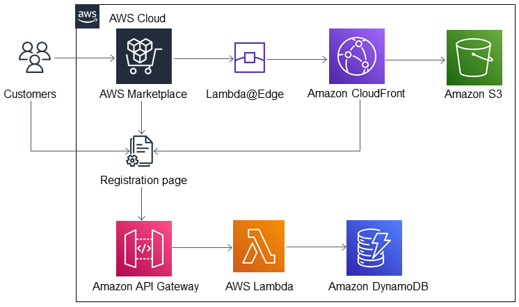

:xrefstyle: short

Deploying this Quick Start builds the following {partner-product-short-name} environment in the
AWS Cloud.

// Replace this example diagram with your own. Follow our wiki guidelines: https://w.amazon.com/bin/view/AWS_Quick_Starts/Process_for_PSAs/#HPrepareyourarchitecturediagram. Upload your source PowerPoint file to the GitHub {deployment name}/docs/images/ directory in this repo. 

[#architecture1]
.Quick Start architecture for {partner-product-short-name} on AWS

As shown in <<architecture1>>, the Quick Start sets up the following:
* AWS Marketplace for managing subscriptions and passing tokens with customer billing identifiers and product codes to AWS Marketplace Metering Service and Entitlement Service APIs. 
* Amazon CloudFront for providing the configurable URL for the SaaS product integration.
* CloudFront Lambda@Edge for intercepting, transforming, and passing customer tokens.
* Amazon S3 for storing the static HTML pages that accept and submit user input to the AWS Marketplace customer endpoints. 
* AWS Lambda for handling customer endpoints and validating AWS Marketplace customer tokens.
* Amazon DynamoDB for storing valid customer records in a DynamoDB table.
* Amazon API Gateway for generating the new endpoint base URL after the AWS CloudFormation stack is deployed. 

//[.small]#* The template that deploys the Quick Start into an existing VPC skips the components marked by asterisks and prompts you for your existing VPC configuration.#
